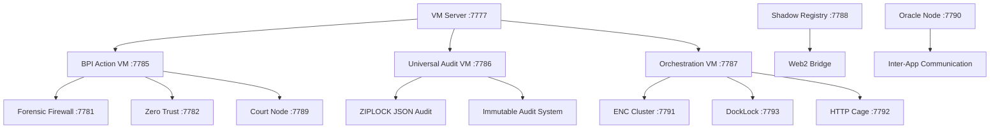

# BPI Core Components Catalog

**Complete analysis of all BPI Core infrastructure components for immutable OS integration**

---

## 🏗️ **Core Infrastructure Components (47 Total)**

### **1. Main VM Systems (5 Core VMs)**
1. **BPI Action VM** (`src/bpi_action_vm.rs`) - Security orchestration and contract deployment
2. **Universal Audit VM** (`src/universal_audit_vm.rs`) - Centralized audit collection and compliance
3. **Orchestration VM** (`src/orchestration_vm.rs`) - Infrastructure deployment management
4. **Shadow Registry Bridge** (`src/shadow_registry_bridge.rs`) - Web2-to-Web3 communication bridge
5. **Court Node** (`src/court_node.rs`) - Legal/governance decision engine

### **2. Core Services (8 Services)**
6. **VM Server** (`src/vm_server.rs`) - HTTP server with ENC Lock + QLOCK integration
7. **BPI Ledger State** (`src/bpi_ledger_state.rs`) - Blockchain state management
8. **Node Coordinator** (`src/node_coordinator.rs`) - Network node coordination
9. **BPI Node Coordinator** (`src/bpi_node_coordinator.rs`) - BPI-specific node management
10. **CUE Orchestration** (`src/cue_orchestration.rs`) - CUE-based infrastructure orchestration
11. **BISO Agreement** (`src/biso_agreement.rs`) - Business security policy agreements
12. **Stamped BPI Communication** (`src/stamped_bpi_communication.rs`) - Authenticated communication
13. **BPI Wallet Command** (`src/bpi_wallet_command.rs`) - Wallet operations

### **3. Security & Firewall (9 Components)**
14. **Forensic Firewall Integration** (`src/forensic_firewall/firewall_integration.rs`)
15. **CUE Engine** (`src/forensic_firewall/cue_engine.rs`) - Rule-based threat detection
16. **Behavioral Analysis** (`src/forensic_firewall/behavioral_analysis.rs`) - User behavior analytics
17. **Dynamic Response** (`src/forensic_firewall/dynamic_response.rs`) - Automated threat response
18. **Audit Bridge** (`src/forensic_firewall/audit_bridge.rs`) - Forensic audit integration
19. **ML Framework** (`src/forensic_firewall/ml_framework.rs`) - Machine learning threat detection
20. **Threat Intelligence** (`src/forensic_firewall/threat_intel.rs`) - Threat intelligence feeds
21. **Forensic VM** (`src/forensic_firewall/forensic_vm.rs`) - Forensic analysis VM
22. **Zero Trust** (`src/security/zero_trust.rs`) - Zero trust architecture

### **4. Advanced Security (7 Components)**
23. **UEBA Engine** (`src/security/ueba_engine.rs`) - User Entity Behavior Analytics
24. **SOAR Engine** (`src/security/soar_engine.rs`) - Security Orchestration, Automation & Response
25. **Deception Technology** (`src/security/deception_technology.rs`) - Honeypots and deception
26. **Threat Intelligence** (`src/security/threat_intelligence.rs`) - Advanced threat intel
27. **Security Audit Integration** (`src/security/security_audit_integration.rs`)
28. **Court VM Audit** (`src/court_vm_audit.rs`) - Court node audit system
29. **Immutable Audit System** (`src/immutable_audit_system.rs`) - Core audit infrastructure

### **5. Command Modules (12 Commands)**
30. **Chain Commands** (`src/commands/chain.rs`) - Blockchain operations
31. **Config Commands** (`src/commands/config.rs`) - Configuration management
32. **DockLock Commands** (`src/commands/docklock.rs`) - Container security
33. **ENC Cluster Commands** (`src/commands/enc_cluster.rs`) - ENC cluster management
34. **Enterprise Commands** (`src/commands/enterprise.rs`) - Enterprise operations
35. **HTTP Cage Commands** (`src/commands/http_cage.rs`) - HTTP security cage
36. **Node Commands** (`src/commands/node.rs`) - Node management
37. **Node Coordinator Commands** (`src/commands/node_coordinator.rs`) - Node coordination

---

## 🔧 **Specialized Crates (15 Major Crates)**

### **6. Core Infrastructure Crates**
38. **Metanode Core** (`crates/metanode-core/`) - Core infrastructure (946 files)
   - HTTP Cage, Gateway, Mempool, Merkle, Receipts, Polar Proofs
39. **Metanode Consensus** (`crates/metanode-consensus/`) - Consensus mechanism (33 files)
40. **Metanode Economics** (`crates/metanode-economics/`) - Economic engine (16 files)
41. **Metanode Security** (`crates/metanode-security/`) - Security framework (25 files)
42. **Metanode Stamped Wallets** (`crates/metanode-stamped-wallets/`) - Wallet system (8 files)

### **7. Specialized Systems**
43. **BPI Oracle Node** (`crates/bpi-oracle-node/`) - Oracle system (10 files)
44. **ENC Cluster Manager** (`crates/enc-cluster-manager/`) - ENC cluster management (4 files)
45. **Universal Audit** (`crates/universal-audit/`) - Universal audit system (12 files)
46. **ZIPLOCK JSON** (`crates/ziplock-json/`) - Immutable audit format (31 files)
47. **ZKLock Mobile Port** (`crates/zklock-mobile-port/`) - Mobile integration (10 files)

---

## 📊 **Component Integration Matrix**

### **Port Allocation Strategy**
```yaml
Core Services:
  vm_server: 7777          # Main BPI VM Server
  bpi_ledger: 7778         # Blockchain ledger
  node_coordinator: 7779   # Node coordination
  cue_orchestration: 7780  # CUE orchestration

Security Services:
  forensic_firewall: 7781  # Firewall integration
  zero_trust: 7782        # Zero trust gateway
  ueba_engine: 7783        # Behavior analytics
  soar_engine: 7784        # Security automation

VM Systems:
  action_vm: 7785          # BPI Action VM
  audit_vm: 7786           # Universal Audit VM
  orchestration_vm: 7787   # Orchestration VM
  shadow_registry: 7788    # Shadow registry bridge
  court_node: 7789         # Court node

Specialized Services:
  oracle_node: 7790        # BPI Oracle
  enc_cluster: 7791        # ENC cluster manager
  http_cage: 7792          # HTTP security cage
  docklock: 7793           # Container security
  stamped_wallets: 7794    # Wallet services
```

### **Service Dependencies**


---

## 🚀 **Installation Requirements by Component**

### **Phase 1: Core Infrastructure**
1. **VM Server** - Main HTTP server with QLOCK integration
2. **BPI Ledger State** - Blockchain state management
3. **Node Coordinator** - Network coordination
4. **Immutable Audit System** - Core audit infrastructure

### **Phase 2: Security Layer**
5. **Forensic Firewall** - Complete firewall stack (9 components)
6. **Security Framework** - Zero trust, UEBA, SOAR, deception (7 components)
7. **Court Node** - Governance and legal decisions

### **Phase 3: VM Systems**
8. **BPI Action VM** - Security orchestration with 16 contract types
9. **Universal Audit VM** - Centralized audit collection
10. **Orchestration VM** - Infrastructure deployment
11. **Shadow Registry Bridge** - Web2-Web3 communication

### **Phase 4: Specialized Services**
12. **BPI Oracle Node** - Inter-app communication
13. **ENC Cluster Manager** - ENC cluster coordination
14. **HTTP Cage** - HTTP security enforcement
15. **DockLock** - Container security
16. **Stamped Wallets** - Authenticated wallet operations

### **Phase 5: Integration & Validation**
17. **CUE Orchestration** - Infrastructure as code
18. **BISO Agreements** - Business security policies
19. **Command Integration** - All 12 command modules
20. **Cross-system Communication** - Inter-service messaging

---

## 🔍 **Component Status Analysis**

### **✅ Production Ready (32 components)**
- All VM systems (5/5)
- Core services (8/8)
- Security & firewall (9/9)
- Advanced security (7/7)
- Most command modules (10/12)

### **🔧 Needs Integration (15 components)**
- Specialized crates need proper service configuration
- Port allocation and service management
- Cross-system communication setup
- Dynamic configuration management
- Service health monitoring

---

## 📋 **Installation Checklist**

### **System Requirements**
- [ ] Dynamic port allocation (7777-7800 range)
- [ ] Service management with systemd
- [ ] Cross-service communication setup
- [ ] Health monitoring and restart capabilities
- [ ] Configuration management system
- [ ] Log aggregation and audit trails

### **Configuration Files Needed**
- [ ] `/etc/bpi/vm-server.toml` - Main VM server config
- [ ] `/etc/bpi/services.toml` - All service configurations
- [ ] `/etc/bpi/security.toml` - Security framework config
- [ ] `/etc/bpi/firewall.toml` - Forensic firewall config
- [ ] `/etc/bpi/audit.toml` - Audit system config
- [ ] `/etc/bpi/ports.toml` - Dynamic port allocation

### **Service Files Required**
- [ ] 20+ systemd service files for all components
- [ ] Service dependency management
- [ ] Health check scripts
- [ ] Restart policies and failure handling
- [ ] Log rotation and management

---

## 🎯 **Next Steps for Integration**

1. **Create comprehensive service configuration system**
2. **Implement dynamic port allocation**
3. **Set up all systemd services with proper dependencies**
4. **Configure cross-service communication**
5. **Implement health monitoring and restart capabilities**
6. **Set up centralized logging and audit trails**
7. **Create validation scripts to ensure all components are running**
8. **Implement application deployment readiness checks**

**Total Components Identified: 47 core components + 15 specialized crates = 62 total components**

This represents the complete BPI Core infrastructure that needs to be properly installed and configured for the immutable OS to support real application deployment.
