# NXOS Dynamic Routing (DRX) Architecture for BPI Immutable OS

**Advanced Network and Filesystem Architecture for Enterprise-Grade BPI Core Deployment**

---

## 🌐 **NXOS DRX Overview**

The BPI Immutable OS requires a sophisticated network architecture that goes far beyond simple Linux port allocation. The NXOS Dynamic Routing (DRX) system provides:

- **Trust-Weighted Routing (TWR)**: Dynamic trust scoring for network paths
- **QLock Session Steering**: Zero-trust session management with micro-reroutes
- **vPod Port Distribution**: Dynamic virtual pod networking
- **Proof-of-Forward (PoF)**: Cryptographic path verification
- **Meta-RIB**: Unified routing information base

---

## 🏗️ **Advanced Filesystem Architecture**

### **Current Problem: Simple Linux Theory**
The current filesystem approach is too simplistic:
```
/opt/bpi-core/          # Too basic
/etc/bpi/               # Insufficient structure
/var/lib/bpi/           # Missing advanced features
```

### **Required: Sophisticated BPI Filesystem**
```
/bpi/                           # BPI Root Namespace
├── core/                       # Core BPI Infrastructure
│   ├── vm-cluster/            # VM Cluster Management
│   │   ├── action-vm/         # BPI Action VM (Port: Dynamic)
│   │   ├── audit-vm/          # Universal Audit VM
│   │   ├── orchestration-vm/  # Orchestration VM
│   │   ├── shadow-registry/   # Shadow Registry Bridge
│   │   └── court-node/        # Court Node VM
│   ├── services/              # Core Services
│   │   ├── vm-server/         # Main VM Server
│   │   ├── ledger-state/      # BPI Ledger State
│   │   ├── node-coordinator/  # Node Coordination
│   │   └── cue-orchestration/ # CUE Orchestration
│   └── security/              # Security Framework
│       ├── forensic-firewall/ # Complete Firewall Stack
│       ├── zero-trust/        # Zero Trust Architecture
│       ├── ueba-engine/       # Behavior Analytics
│       └── soar-engine/       # Security Automation
├── nxos/                      # NXOS DRX Network Layer
│   ├── drx-control/           # DRX Control Plane
│   │   ├── meta-rib/          # Meta Routing Information Base
│   │   ├── trust-scoring/     # Trust Weight Calculation
│   │   ├── policy-engine/     # Intent-to-Policy Compiler
│   │   └── path-computation/  # Multi-Constraint SPF
│   ├── drx-data/              # DRX Data Plane
│   │   ├── ebpf-forwarder/    # eBPF/XDP Packet Processing
│   │   ├── qlock-steering/    # QLock Session Management
│   │   ├── segment-routing/   # SR-like Path Management
│   │   └── proof-of-forward/  # PoF Verification
│   └── vpod-network/          # vPod Network Management
│       ├── port-allocation/   # Dynamic Port Distribution
│       ├── network-topology/  # Network Graph Management
│       ├── service-mesh/      # Service-to-Service Communication
│       └── load-balancing/    # Intelligent Load Distribution
├── data/                      # BPI Data Layer
│   ├── immutable/             # Immutable Data Storage
│   │   ├── audit-trails/      # ZIPLOCK-JSON Audit Data
│   │   ├── blockchain-state/  # Blockchain State Data
│   │   ├── contract-storage/  # Smart Contract Storage
│   │   └── proof-chains/      # Cryptographic Proof Chains
│   ├── overlay/               # Overlay Filesystems
│   │   ├── user-data/         # User Application Data
│   │   ├── app-configs/       # Application Configurations
│   │   ├── temp-storage/      # Temporary Storage
│   │   └── cache-layer/       # Performance Cache
│   └── encrypted/             # Encrypted Storage
│       ├── wallet-keys/       # Wallet Key Storage
│       ├── tpm-sealed/        # TPM-Sealed Data
│       ├── qlock-sessions/    # QLock Session Data
│       └── pq-crypto/         # Post-Quantum Crypto Keys
├── config/                    # Configuration Management
│   ├── system/                # System-Level Configuration
│   │   ├── nxos-drx.yaml     # NXOS DRX Configuration
│   │   ├── vm-cluster.yaml   # VM Cluster Configuration
│   │   ├── security.yaml     # Security Framework Config
│   │   └── network.yaml      # Network Configuration
│   ├── services/              # Service Configurations
│   │   ├── vm-server.toml    # VM Server Configuration
│   │   ├── firewall.toml     # Firewall Configuration
│   │   ├── audit.toml        # Audit System Configuration
│   │   └── orchestration.toml # Orchestration Configuration
│   └── policies/              # Policy Definitions
│       ├── intent-policies/   # Network Intent Policies
│       ├── security-policies/ # Security Policy Rules
│       ├── trust-policies/    # Trust Scoring Policies
│       └── compliance/        # Regulatory Compliance
└── runtime/                   # Runtime State
    ├── processes/             # Process Management
    │   ├── vm-processes/      # VM Process States
    │   ├── service-states/    # Service Runtime States
    │   └── health-monitors/   # Health Monitoring
    ├── network/               # Network Runtime State
    │   ├── active-sessions/   # Active QLock Sessions
    │   ├── routing-tables/    # Dynamic Routing Tables
    │   ├── trust-scores/      # Real-time Trust Scores
    │   └── traffic-flows/     # Active Traffic Flows
    └── logs/                  # Structured Logging
        ├── audit-logs/        # Immutable Audit Logs
        ├── security-events/   # Security Event Logs
        ├── network-events/    # Network Event Logs
        └── system-metrics/    # System Performance Metrics
```

---

## 🌐 **NXOS DRX Network Architecture**

### **1. Control Plane (DRX-CP)**

**Meta-RIB Components**:
```yaml
meta_rib:
  underlay_metrics:
    - link_state: IGP-like topology
    - bandwidth: Available capacity
    - latency: Real-time RTT measurements
    - loss_rate: Packet loss statistics
  
  overlay_services:
    - service_graph: L7 service mesh topology
    - vip_mappings: Virtual IP to service mappings
    - shard_distribution: Service shard locations
    - load_balancing: Traffic distribution policies
  
  trust_graph:
    - wallet_handshakes: Authenticated node relationships
    - rbac_policies: Role-based access control
    - attestation_state: TPM/TEE verification status
    - trust_scores: Dynamic trust calculations
  
  compliance_hints:
    - carbon_footprint: Environmental impact scoring
    - geo_constraints: Geographic routing restrictions
    - jurisdiction_rules: Legal compliance requirements
    - regulatory_policies: Industry-specific rules
```

**Trust-Weighted Routing (TWR)**:
```rust
pub struct TrustWeightedPath {
    pub base_cost: f64,           // Traditional routing cost
    pub trust_penalty: f64,       // Trust score impact
    pub compliance_factor: f64,   // Regulatory compliance
    pub carbon_score: f64,        // Environmental impact
    pub jurisdiction_risk: f64,   // Legal jurisdiction risk
}

impl TrustWeightedPath {
    pub fn calculate_total_cost(&self) -> f64 {
        self.base_cost 
            + (self.trust_penalty * TRUST_WEIGHT_FACTOR)
            + (self.compliance_factor * COMPLIANCE_WEIGHT)
            + (self.carbon_score * CARBON_WEIGHT)
            + (self.jurisdiction_risk * JURISDICTION_WEIGHT)
    }
}
```

### **2. Data Plane (DRX-DP)**

**eBPF/XDP Packet Processing**:
```c
// Simplified eBPF program structure
struct bpf_drx_packet {
    struct ethhdr eth;
    struct iphdr ip;
    struct drx_header {
        __u8 version;
        __u16 flow_id;
        __u8 dscp;
        __u8 ttl;
        struct segment_list {
            __u32 sid[MAX_SEGMENTS];
            __u8 flags; // qSID, tSID, aSID, sSID
        } segments;
        struct qlock_token {
            __u32 session_id;
            __u32 token_mac;
        } qlock;
        __u8 sapi_bits; // httpcg modes
        struct proof_capsule {
            __u32 hop_count;
            __u8 hmac_chain[HMAC_SIZE];
        } pof;
    } drx;
    __u8 payload[];
};
```

**Segment Routing with Proof SIDs**:
```yaml
segment_types:
  qSID: # QoS/Latency Guard
    latency_budget: "5ms"
    jitter_tolerance: "2ms"
    bandwidth_guarantee: "100Mbps"
  
  tSID: # Trust Floor
    minimum_trust_score: 0.8
    attestation_required: true
    wallet_verification: mandatory
  
  aSID: # Attestation Required
    tpm_quote: required
    kernel_integrity: verified
    secure_boot: enforced
  
  sSID: # Shadow-API Path
    httpcg_mode: enabled
    audit_trail: mandatory
    privacy_preserving: true
```

### **3. vPod Port Distribution**

**Dynamic Port Allocation Strategy**:
```yaml
vpod_network_architecture:
  base_range: 7777-8777  # 1000 ports for BPI Core
  
  core_services: # 7777-7799 (23 ports)
    vm_server: 7777
    bpi_ledger: 7778
    node_coordinator: 7779
    cue_orchestration: 7780
    # ... additional core services
  
  vm_cluster: # 7800-7829 (30 ports)
    action_vm_base: 7800
    audit_vm_base: 7810
    orchestration_vm_base: 7820
    shadow_registry_base: 7825
    court_node_base: 7828
  
  security_services: # 7830-7859 (30 ports)
    forensic_firewall: 7830-7839
    zero_trust_gateway: 7840-7844
    ueba_engine: 7845-7849
    soar_engine: 7850-7854
    deception_tech: 7855-7859
  
  specialized_services: # 7860-7899 (40 ports)
    oracle_node: 7860-7869
    enc_cluster: 7870-7879
    http_cage: 7880-7889
    docklock: 7890-7894
    stamped_wallets: 7895-7899
  
  dynamic_allocation: # 7900-8777 (877 ports)
    application_pods: 7900-8500
    inter_service_mesh: 8501-8600
    load_balancers: 8601-8650
    monitoring_stack: 8651-8700
    backup_services: 8701-8750
    emergency_services: 8751-8777
```

**vPod Network Topology**:

```mermaid
graph TB
    subgraph "NXOS DRX Control Plane"
        MRB[Meta-RIB]
        TSE[Trust Scoring Engine]
        PCE[Path Computation Engine]
        PE[Policy Engine]
    end
    
    subgraph "vPod Network Layer"
        VPA[vPod Port Allocator]
        NTM[Network Topology Manager]
        SMC[Service Mesh Controller]
        LBM[Load Balance Manager]
    end
    
    subgraph "BPI Core Services"
        VMS[VM Server :7777]
        BL[BPI Ledger :7778]
        NC[Node Coordinator :7779]
        CO[CUE Orchestration :7780]
    end
    
    subgraph "VM Cluster"
        AVM[Action VM :7800-7809]
        AUVM[Audit VM :7810-7819]
        OVM[Orchestration VM :7820-7824]
        SRB[Shadow Registry :7825-7827]
        CN[Court Node :7828-7829]
    end
    
    subgraph "Security Framework"
        FF[Forensic Firewall :7830-7839]
        ZT[Zero Trust :7840-7844]
        UE[UEBA Engine :7845-7849]
        SE[SOAR Engine :7850-7854]
    end
    
    MRB --> VPA
    TSE --> SMC
    PCE --> LBM
    PE --> VPA
    
    VPA --> VMS
    VPA --> BL
    VPA --> NC
    VPA --> CO
    
    SMC --> AVM
    SMC --> AUVM
    SMC --> OVM
    SMC --> SRB
    SMC --> CN
    
    LBM --> FF
    LBM --> ZT
    LBM --> UE
    LBM --> SE
```


---

## 🔐 **Security Integration**

### **Wallet-Based Network Authentication**
```yaml
network_security:
  neighbor_discovery:
    wallet_handshake: mandatory
    rbac_verification: required
    mutual_authentication: enforced
  
  node_attestation:
    tpm_quote: required
    secure_boot_verification: mandatory
    kernel_integrity_check: continuous
  
  session_management:
    qlock_tokens: per_flow_unique
    session_lifetime: dynamic
    micro_reroute_capability: enabled
```

### **Post-Quantum Path Sealing**
```yaml
cryptographic_protection:
  control_plane:
    signature_algorithm: dilithium3
    key_exchange: kyber1024
    update_frequency: hourly
  
  data_plane:
    hmac_algorithm: blake3
    token_rotation: per_session
    pq_rekey_interval: daily
```

---

## 📊 **Policy Engine Configuration**

### **Intent-Based Networking**
```yaml
network_intents:
  - name: ultra_low_latency
    match:
      service_type: real_time_api
      priority: critical
    goals:
      latency_p50: "<=2ms"
      jitter_p95: "<=1ms"
      availability: "99.99%"
    constraints:
      trust_floor: 0.9
      attestation: required
      carbon_max: 20
    actions:
      path_type: segment_routing
      repair_method: ti_lfa
      telemetry: proof_of_forward

  - name: high_security_banking
    match:
      service_type: banking_api
      compliance: pci_dss
    goals:
      security_level: maximum
      audit_coverage: complete
    constraints:
      trust_floor: 0.95
      jurisdiction_allow: [US, EU, CA]
      attestation: mandatory
    actions:
      path_type: attested_segments
      encryption: post_quantum
      audit: immutable_trail

  - name: government_compliance
    match:
      service_type: government_api
      classification: restricted
    goals:
      compliance: fisma_high
      data_sovereignty: enforced
    constraints:
      trust_floor: 0.98
      geo_restriction: domestic_only
      attestation: tpm_required
    actions:
      path_type: verified_segments
      monitoring: continuous
      incident_response: automated
```

---

## 🚀 **Installation Integration**

### **NXOS DRX Setup Process**
```rust
pub struct NxosDrxInstaller {
    filesystem_manager: AdvancedFilesystemManager,
    network_configurator: VpodNetworkConfigurator,
    security_integrator: SecurityFrameworkIntegrator,
    policy_compiler: IntentPolicyCompiler,
}

impl NxosDrxInstaller {
    pub async fn setup_advanced_filesystem(&self) -> Result<()> {
        // Create sophisticated BPI filesystem structure
        self.create_bpi_namespace().await?;
        self.setup_immutable_storage().await?;
        self.configure_overlay_filesystems().await?;
        self.initialize_encrypted_storage().await?;
        Ok(())
    }
    
    pub async fn configure_vpod_networking(&self) -> Result<()> {
        // Setup vPod network architecture
        self.initialize_drx_control_plane().await?;
        self.setup_ebpf_data_plane().await?;
        self.configure_dynamic_port_allocation().await?;
        self.establish_service_mesh().await?;
        Ok(())
    }
    
    pub async fn deploy_bpi_infrastructure(&self) -> Result<()> {
        // Deploy all 62 BPI Core components
        self.deploy_core_services().await?;
        self.deploy_vm_cluster().await?;
        self.deploy_security_framework().await?;
        self.deploy_specialized_services().await?;
        self.validate_full_deployment().await?;
        Ok(())
    }
}
```

---

## 🎯 **Implementation Roadmap**

### **Phase 1: Foundation (Week 1)**
1. **Advanced Filesystem Setup**
   - Create sophisticated `/bpi/` namespace
   - Setup immutable and overlay storage layers
   - Configure encrypted storage with TPM integration

2. **NXOS DRX Control Plane**
   - Implement Meta-RIB foundation
   - Setup trust scoring engine
   - Create policy compiler framework

### **Phase 2: Network Layer (Week 2)**
3. **vPod Network Configuration**
   - Dynamic port allocation system
   - Service mesh controller
   - Load balancing infrastructure

4. **Data Plane Implementation**
   - eBPF/XDP packet processing
   - Segment routing with proof SIDs
   - QLock session management

### **Phase 3: BPI Integration (Week 3)**
5. **Core Services Deployment**
   - All 62 BPI Core components
   - Cross-service communication
   - Health monitoring and restart

6. **Security Framework**
   - Complete security stack integration
   - Trust-weighted routing
   - Post-quantum cryptography

### **Phase 4: Validation (Week 4)**
7. **End-to-End Testing**
   - Application deployment readiness
   - httpcage/iotgateway/shadowregistry validation
   - Performance and security benchmarking

---

## 📋 **Next Steps**

1. **Implement AdvancedFilesystemManager** with sophisticated BPI namespace
2. **Create VpodNetworkConfigurator** with NXOS DRX integration
3. **Build SecurityFrameworkIntegrator** with trust-weighted routing
4. **Develop IntentPolicyCompiler** for network intent processing
5. **Integrate all 62 BPI Core components** with proper dependencies
6. **Validate complete infrastructure** for real application deployment

This architecture provides the enterprise-grade foundation needed for the BPI Immutable OS to support real-world applications with military-grade security, compliance, and performance.
