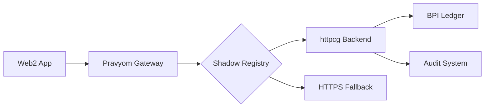

# 🌐 Web2 Compatibility Guide - Pravyom Internet for Existing Apps

## 🎯 **ZERO-CONFIG INTEGRATION FOR ANY WEB2 APP**

### **📋 Overview**
Transform any existing web2 application to use the Pravyom Internet infrastructure **without changing a single line of code**. The Shadow Registry provides transparent proxy functionality with progressive enhancement capabilities.

---

## 🚀 **INSTANT INTEGRATION - 3 SIMPLE STEPS**

### **Step 1: Add Pravyom.js SDK (Optional)**
```html
<!-- Optional: Enhanced features with 1-line integration -->
<script src="https://cdn.pravyom.com/pravyom.js"></script>
```

### **Step 2: Route Traffic Through Pravyom Gateway**
```bash
# DNS/CDN Configuration - Point your domain to Pravyom Gateway
app.example.com → pravyom-gateway.com/proxy/app.example.com
```

### **Step 3: Zero Configuration Required**
Your app automatically gets:
- ✅ **Quantum-safe transport** (transparent)
- ✅ **BPI ledger anchoring** (automatic)
- ✅ **SAPI security headers** (gateway-injected)
- ✅ **Audit trails** (background)
- ✅ **Payment rails** (optional upgrade)

---

## 🔧 **PROGRESSIVE ENHANCEMENT LEVELS**

### **Level 0: Transparent Proxy (Zero Changes)**
```javascript
// Your existing code works unchanged
fetch('/api/users')
  .then(response => response.json())
  .then(data => console.log(data));

// Gateway automatically provides:
// - SAPI-Proof headers
// - BPI anchoring
// - Audit trails
// - Basic security
```

### **Level 1: Enhanced with Pravyom.js**
```javascript
// Optional: Detect Pravyom capabilities
if (window.Pravyom) {
  // Enhanced features available
  const wallet = await Pravyom.getWallet();
  const payment = await Pravyom.createPayment({
    amount: 10.00,
    currency: 'USD'
  });
}

// Fallback to standard HTTP
fetch('/api/users')
  .then(response => response.json())
  .then(data => console.log(data));
```

### **Level 2: Full httpcg Integration**
```javascript
// Upgrade to native httpcg protocol
const response = await fetch('httpcg://app/app.example.com/api/users', {
  headers: {
    'Authorization': 'Bearer ' + await Pravyom.getESHToken(),
    'SAPI-Proof': await Pravyom.getSAPIProof()
  }
});
```

---

## 🌐 **SHADOW REGISTRY AUTO-MAPPING**

### **Automatic URL Translation**
```yaml
# Shadow Registry Configuration (Auto-Generated)
mappings:
  - https_url: "https://app.example.com/api/*"
    httpcg_url: "httpcg://app/app.example.com/api/*"
    web2_mode: true
    security_level: "basic"
    
  - https_url: "https://api.example.com/v1/*"
    httpcg_url: "httpcg://bpi/bpi.example.com/hash.bpi/*/api/*"
    web2_mode: true
    security_level: "enhanced"
```

### **Gateway Behavior**


---

## 🔒 **SECURITY LEVELS**

### **Basic (Default for Web2)**
- ✅ **TLS 1.3** standard encryption
- ✅ **SAPI headers** (gateway-injected)
- ✅ **Basic audit trails**
- ✅ **Standard authentication**

### **Enhanced (With Pravyom.js)**
- ✅ **ESH tokens** (wallet-based auth)
- ✅ **DPoP proof-of-possession**
- ✅ **BPI anchoring** (30-second bundling)
- ✅ **Payment integration**

### **Full (Native httpcg)**
- ✅ **QLOCK session locks**
- ✅ **TLSLS certificates**
- ✅ **Post-quantum security**
- ✅ **Complete audit system**

---

## 💰 **PAYMENT INTEGRATION**

### **Zero-Config Payments**
```javascript
// Existing payment code
const payment = {
  amount: 100.00,
  currency: 'USD',
  method: 'credit_card'
};

// Automatically enhanced with Pravyom
// - Settlement via bank rails
// - BPI anchored receipts
// - Fraud protection
// - Cross-border support
```

### **Enhanced Payment Features**
```javascript
// With Pravyom.js SDK
const payment = await Pravyom.createPayment({
  amount: 100.00,
  currency: 'USD',
  rails: ['ACH', 'SEPA', 'INTERAC'], // Multi-rail support
  anchor: true,                      // BPI ledger receipt
  compliance: 'auto'                 // Automatic regulatory compliance
});
```

---

## 🌍 **GOVERNMENT & BANKING INTEGRATION**

### **Automatic Compliance**
```yaml
# Auto-configured based on user location
compliance:
  jurisdiction: "auto-detect"
  tax_reporting: true
  kyc_level: "basic"
  data_residency: "local"
```

### **Banking Rail Integration**
```javascript
// Automatic bank rail selection
const settlement = await Pravyom.settle({
  amount: 1000.00,
  from_account: "user_wallet",
  to_account: "merchant_bank",
  rail: "auto", // ACH/SEPA/INTERAC/RTP auto-selected
  compliance: true
});
```

---

## 📊 **MIGRATION EXAMPLES**

### **E-commerce Site**
```html
<!-- Before: Standard e-commerce -->
<script src="stripe.js"></script>
<script>
  // Standard payment processing
  const stripe = Stripe('pk_test_...');
</script>

<!-- After: Enhanced with Pravyom (optional) -->
<script src="https://cdn.pravyom.com/pravyom.js"></script>
<script src="stripe.js"></script>
<script>
  // Existing code works unchanged
  const stripe = Stripe('pk_test_...');
  
  // Optional: Enhanced features
  if (window.Pravyom) {
    // Multi-rail payments, BPI receipts, compliance
    const enhanced = await Pravyom.enhancePayments(stripe);
  }
</script>
```

### **SaaS Application**
```javascript
// Before: Standard API calls
const users = await fetch('/api/users').then(r => r.json());

// After: Automatic enhancement (zero changes required)
const users = await fetch('/api/users').then(r => r.json());
// Gateway automatically provides:
// - SAPI security headers
// - BPI audit trails
// - Enhanced authentication
// - Cross-border compliance
```

### **Banking Application**
```javascript
// Before: Standard banking API
const transfer = await bankAPI.transfer({
  from: 'account1',
  to: 'account2',
  amount: 1000
});

// After: Enhanced with settlement rails
const transfer = await bankAPI.transfer({
  from: 'account1',
  to: 'account2',
  amount: 1000
});
// Automatically enhanced with:
// - Multi-rail settlement (ACH/SEPA/INTERAC/RTP)
// - BPI anchored receipts
// - Regulatory compliance
// - Fraud detection
```

---

## 🔧 **DEPLOYMENT GUIDE**

### **Option 1: DNS Routing (Simplest)**
```bash
# Point your domain to Pravyom Gateway
dig app.example.com
# CNAME app.example.com → gateway.pravyom.com
```

### **Option 2: CDN Integration**
```yaml
# CloudFlare/AWS CloudFront configuration
origin:
  primary: "gateway.pravyom.com"
  fallback: "original-server.com"
headers:
  - name: "X-Pravyom-Proxy"
    value: "app.example.com"
```

### **Option 3: Load Balancer**
```nginx
# NGINX configuration
upstream pravyom_backend {
    server gateway.pravyom.com:443;
    server original-backend.com:443 backup;
}

server {
    listen 443 ssl;
    server_name app.example.com;
    
    location / {
        proxy_pass https://pravyom_backend;
        proxy_set_header X-Original-Host $host;
        proxy_set_header X-Pravyom-Proxy "true";
    }
}
```

---

## 📈 **BENEFITS FOR WEB2 APPS**

### **Immediate Benefits (Zero Config)**
- ✅ **Enhanced Security** - Quantum-safe transport
- ✅ **Audit Trails** - Complete request/response logging
- ✅ **Global CDN** - Pravyom gateway network
- ✅ **DDoS Protection** - Built-in security
- ✅ **Compliance** - Automatic regulatory adherence

### **Progressive Benefits (With SDK)**
- ✅ **Wallet Integration** - User identity management
- ✅ **Payment Rails** - Multi-currency, multi-rail support
- ✅ **BPI Anchoring** - Immutable transaction receipts
- ✅ **Cross-border** - Seamless international operations
- ✅ **Government APIs** - Direct integration with authorities

### **Full Benefits (Native httpcg)**
- ✅ **Post-quantum Security** - Future-proof cryptography
- ✅ **QLOCK Sessions** - Un-bridgeable session locks
- ✅ **Advanced Storage** - CueDB integration
- ✅ **Economic Model** - 4-coin autonomous economy
- ✅ **Internet Governance** - Participate in global governance

---

## 🎯 **GETTING STARTED TODAY**

### **Step 1: Register Your App**
```bash
curl -X POST https://api.pravyom.com/v1/register \
  -H "Content-Type: application/json" \
  -d '{
    "domain": "app.example.com",
    "type": "web2_proxy",
    "security_level": "basic"
  }'
```

### **Step 2: Update DNS (Optional)**
```bash
# Point your domain to Pravyom Gateway
app.example.com CNAME gateway.pravyom.com
```

### **Step 3: Test Integration**
```bash
# Your app automatically gets enhanced features
curl https://app.example.com/api/health
# Response includes Pravyom headers:
# X-Pravyom-Anchored: <bpi_tx_hash>
# X-Pravyom-Audit: <audit_trail_id>
# X-Pravyom-Security: basic
```

---

## 🌟 **CONCLUSION**

**The Pravyom Internet makes quantum-safe, government-integrated, bank-connected infrastructure available to ANY web2 application with ZERO code changes required.**

- **Today**: Add `<script src="pravyom.js">` for enhanced features
- **Tomorrow**: Point DNS to Pravyom Gateway for automatic enhancement
- **Future**: Upgrade to native httpcg for full post-quantum security

**Your existing web2 app can be running on the Pravyom Internet within minutes.**
