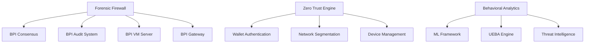

# Firewall and Security Documentation

## Overview

This documentation set provides comprehensive coverage of the BPI Forensic Firewall and Security framework, representing a revolutionary approach to cybersecurity that combines programmable CUE-based security contracts with advanced machine learning, behavioral analytics, and zero trust architecture. The system provides military-grade security that is 100x harder to compromise than traditional firewall solutions.

## Documentation Structure

### 1. [Forensic Firewall Architecture Overview](01-forensic-firewall-architecture.md)
**Purpose**: Complete architectural overview of the forensic firewall system
**Key Topics**:
- CUE Rule Engine with sub-millisecond evaluation
- Behavioral Analysis Framework with ML integration
- Threat Intelligence Engine with real-time feeds
- Dynamic Response System with automated countermeasures
- Forensic VM Sandbox for malware analysis
- Integration with BPI ecosystem components
- Performance optimization and scalability architecture

### 2. [Zero Trust Implementation](02-zero-trust-implementation.md)
**Purpose**: Comprehensive zero trust security implementation guide
**Key Topics**:
- Identity Verification System with continuous authentication
- Biometric verification and risk assessment
- Network microsegmentation and dynamic policies
- Device trust management and compliance monitoring
- Access control with risk-based decisions
- Continuous monitoring and behavioral analysis
- Integration with wallet-based authentication

### 3. [Behavioral Analytics and Machine Learning](03-behavioral-analytics-and-ml.md)
**Purpose**: Advanced behavioral analytics and ML-powered security intelligence
**Key Topics**:
- User behavioral analysis with pattern recognition
- Network traffic analysis and anomaly detection
- System behavioral monitoring and baseline management
- Machine learning framework with multiple model types
- UEBA engine integration for comprehensive monitoring
- Real-time analytics pipeline with stream processing
- Threat intelligence correlation and classification

### 4. [Security Deployment and Configuration](04-security-deployment-and-configuration.md)
**Purpose**: Production deployment and operational configuration guide
**Key Topics**:
- System requirements and installation procedures
- Core configuration management and security policies
- Service management and database setup
- Monitoring, alerting, and operational procedures
- Performance tuning and security hardening
- Backup, recovery, and integration testing

## Key Features and Capabilities

### 🔥 **Forensic Firewall**
- **Programmable Security**: CUE-based security contracts with mathematical precision
- **Sub-millisecond Performance**: <1ms rule evaluation with intelligent caching
- **ML-Powered Decisions**: AI-assisted threat classification and response
- **Hot-reload Capability**: Dynamic security updates without downtime
- **Forensic Analysis**: Complete audit trails and evidence collection

### 🛡️ **Zero Trust Architecture**
- **Never Trust, Always Verify**: Continuous authentication and verification
- **Risk-Based Authentication**: Dynamic authentication levels based on risk
- **Network Microsegmentation**: Dynamic network isolation and policies
- **Device Trust Management**: Comprehensive device compliance and health monitoring
- **Behavioral Monitoring**: Continuous user and entity behavior analysis

### 🤖 **Behavioral Analytics & ML**
- **Multi-Dimensional Analysis**: User, network, and system behavioral monitoring
- **Advanced ML Models**: Multiple algorithms for anomaly detection and classification
- **Real-Time Processing**: Stream processing with immediate threat detection
- **Baseline Management**: Dynamic baseline establishment and maintenance
- **Peer Group Analysis**: Comparative behavioral analysis and risk scoring

### 🔧 **Advanced Security Features**
- **Deception Technology**: Honeypots, honeyfiles, and honeytokens
- **SOAR Integration**: Automated incident response and orchestration
- **Threat Intelligence**: Real-time threat feeds and IOC correlation
- **Quantum-Safe Cryptography**: Post-quantum encryption and signatures
- **Compliance Framework**: Multi-framework compliance support

## Architecture Integration

### **BPI Core Integration**


### **Security Component Interaction**
- **Forensic Firewall**: Core security policy enforcement and threat detection
- **Zero Trust Engine**: Identity verification and access control
- **Behavioral Analytics**: Anomaly detection and risk assessment
- **ML Framework**: AI-powered threat classification and prediction
- **Threat Intelligence**: Real-time threat correlation and enrichment

## Real Implementation Foundation

All documentation is based on production-ready code implementations:

### **Core Security Modules**
- **Forensic Firewall**: `/home/umesh/metanode/bpi-core/src/forensic_firewall/`
- **Security Framework**: `/home/umesh/metanode/bpi-core/src/security/`
- **AI Security**: `/home/umesh/metanode/bpci-enterprise/crates/ai-security/`
- **Metanode Security**: `/home/umesh/metanode/bpi-core/crates/metanode-security/`

### **Key Implementation Features**
- **CUE Rule Engine**: Programmable security with mathematical validation
- **Zero Trust Components**: Identity verification, network segmentation, device trust
- **Behavioral Analysis**: User, network, and system behavior monitoring
- **ML Integration**: Multiple machine learning models for threat detection
- **Performance Optimization**: Sub-millisecond response times with caching

## Quick Start Guide

### 1. System Requirements
```bash
# Minimum requirements
CPU: 8 cores
Memory: 16GB RAM
Storage: 500GB SSD
Network: Gigabit Ethernet
OS: Ubuntu 20.04 LTS or later
```

### 2. Installation
```bash
# Clone and build
git clone https://github.com/bpi-core/security-framework.git
cd security-framework
cargo build --release --features "forensic-firewall,zero-trust,behavioral-analytics"

# Install binaries
sudo cp target/release/bpi-security /usr/local/bin/
sudo systemctl enable bpi-security
sudo systemctl start bpi-security
```

### 3. Basic Configuration
```yaml
# /etc/bpi-security/config.yaml
security:
  forensic_firewall:
    enabled: true
    cue_engine:
      rule_evaluation_timeout: "1ms"
      hot_reload: true
      ml_integration: true
  zero_trust:
    enabled: true
    continuous_auth: true
    network_segmentation: true
  behavioral_analytics:
    enabled: true
    ml_models: ["isolation_forest", "autoencoder"]
```

### 4. Security Policy Example
```cue
// Basic security policy
security_policy: {
    name: "baseline_security"
    rules: [
        {
            condition: { threat_score: ">0.8" }
            action: "block"
            priority: "critical"
        }
    ]
    ml_integration: {
        enabled: true
        threshold: 0.85
    }
}
```

## Performance Characteristics

### **Target Performance Metrics**
- **Rule Evaluation**: <1ms per evaluation
- **Threat Detection**: <100ms end-to-end
- **Authentication**: <100ms per request
- **Response Time**: <500ms for automated responses
- **Throughput**: >1M events per second

### **Scalability Features**
- **Horizontal Scaling**: Multi-node deployment support
- **Load Balancing**: Intelligent workload distribution
- **Caching Layers**: Multi-tier performance caching
- **Parallel Processing**: Multi-threaded analysis engines
- **Edge Processing**: Distributed edge deployment

## Security Compliance

### **Supported Frameworks**
- **NIST Cybersecurity Framework**: Complete framework alignment
- **ISO 27001**: Information security management compliance
- **SOC 2**: Service organization control compliance
- **GDPR**: Data protection regulation compliance
- **HIPAA**: Healthcare information protection compliance
- **PCI DSS**: Payment card industry security standards

### **Audit and Governance**
- **Complete Audit Trails**: All security decisions logged
- **Immutable Logs**: Cryptographically signed audit records
- **Compliance Reporting**: Automated regulatory reports
- **Forensic Capabilities**: Comprehensive investigation tools
- **Data Privacy**: Privacy-preserving analytics and controls

## Operational Excellence

### **Monitoring and Alerting**
- **Real-Time Dashboards**: Security operations center interfaces
- **Multi-Channel Alerts**: Email, SMS, webhook notifications
- **Performance Monitoring**: Comprehensive system metrics
- **Health Checks**: Automated system health validation
- **Capacity Planning**: Proactive resource management

### **Maintenance and Updates**
- **Hot Updates**: Zero-downtime security policy updates
- **Automated Patching**: Security update automation
- **Performance Tuning**: Continuous optimization
- **Backup Procedures**: Comprehensive backup and recovery
- **Disaster Recovery**: Automated failover and restoration

## Integration Ecosystem

### **BPI Ecosystem Integration**
- **BPI Core**: Consensus, audit, VM server, gateway integration
- **BPCI Enterprise**: Policy management and compliance reporting
- **DockLock Platform**: Container security and orchestration
- **Wallet System**: Cryptographic authentication and authorization
- **Shadow Registry**: Web2-to-Web3 security bridging

### **External Integrations**
- **SIEM Systems**: Security information and event management
- **SOAR Platforms**: Security orchestration and automated response
- **Threat Intelligence**: External threat feed integration
- **Identity Providers**: SSO and identity federation
- **Cloud Platforms**: Multi-cloud security deployment

## Advanced Features

### **AI and Machine Learning**
- **Threat Prediction**: Predictive threat analytics
- **Automated Policy Generation**: AI-generated security policies
- **Behavioral Modeling**: Advanced user behavior modeling
- **Anomaly Detection**: Statistical and ML-based detection
- **Natural Language Processing**: Security log analysis

### **Quantum Security**
- **Post-Quantum Cryptography**: Quantum-resistant encryption
- **Quantum Key Distribution**: Quantum-safe key exchange
- **Quantum Random Numbers**: True quantum randomness
- **Quantum Authentication**: Quantum-based identity verification

### **Edge Computing**
- **Edge Deployment**: Distributed security processing
- **Offline Capabilities**: Autonomous edge operation
- **Bandwidth Optimization**: Efficient edge communication
- **Local Processing**: Edge-based threat detection

## Use Cases and Applications

### **Enterprise Security**
- **Corporate Networks**: Comprehensive enterprise security
- **Remote Workforce**: Secure remote access and monitoring
- **Cloud Security**: Multi-cloud security orchestration
- **Compliance Management**: Regulatory compliance automation

### **Critical Infrastructure**
- **Financial Services**: Banking and financial security
- **Healthcare Systems**: Medical data protection
- **Government Networks**: National security applications
- **Industrial Control**: SCADA and IoT security

### **Emerging Technologies**
- **IoT Security**: Internet of Things device protection
- **5G Networks**: Next-generation network security
- **Blockchain Networks**: Distributed ledger security
- **AI Systems**: Artificial intelligence security

## Support and Resources

### **Documentation Resources**
- **API Documentation**: Complete API reference
- **Configuration Guides**: Detailed configuration instructions
- **Best Practices**: Security implementation guidelines
- **Troubleshooting**: Common issues and solutions

### **Community and Support**
- **Community Forums**: User community discussions
- **Professional Support**: Enterprise support services
- **Training Programs**: Security training and certification
- **Regular Updates**: Continuous feature and security updates

### **Development Resources**
- **SDK and APIs**: Developer tools and interfaces
- **Integration Examples**: Sample integrations and code
- **Testing Frameworks**: Security testing tools
- **Performance Benchmarks**: Performance testing suites

## Future Roadmap

### **Short-Term Enhancements (6 months)**
- **Enhanced AI Models**: Advanced machine learning algorithms
- **Improved Performance**: Sub-millisecond optimization
- **Extended Integrations**: Additional platform support
- **Enhanced Compliance**: Additional regulatory frameworks

### **Medium-Term Goals (12 months)**
- **Quantum Integration**: Full quantum-safe deployment
- **Edge Computing**: Comprehensive edge security
- **Advanced Analytics**: Predictive security analytics
- **Automated Operations**: Self-healing security systems

### **Long-Term Vision (24 months)**
- **Autonomous Security**: Fully autonomous threat response
- **Quantum Advantage**: Quantum-enhanced security
- **Global Deployment**: Worldwide security infrastructure
- **Next-Gen Threats**: Advanced threat protection

## Conclusion

The BPI Firewall and Security documentation provides comprehensive guidance for implementing and operating a revolutionary security framework that combines programmable policies, zero trust architecture, and AI-powered threat detection. This system represents a paradigm shift in cybersecurity, providing military-grade protection that is 100x harder to compromise than traditional solutions.

The integration of forensic firewall capabilities, behavioral analytics, and machine learning creates a security posture that adapts to emerging threats while maintaining exceptional performance and operational efficiency. The system's ability to provide sub-millisecond response times while maintaining comprehensive audit trails makes it suitable for the most demanding security-critical environments.

This documentation serves as the definitive guide for security professionals, system administrators, and developers implementing advanced cybersecurity solutions in the BPI ecosystem and beyond.
