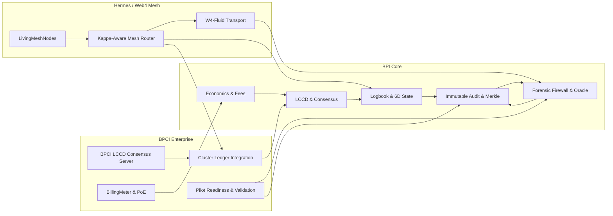
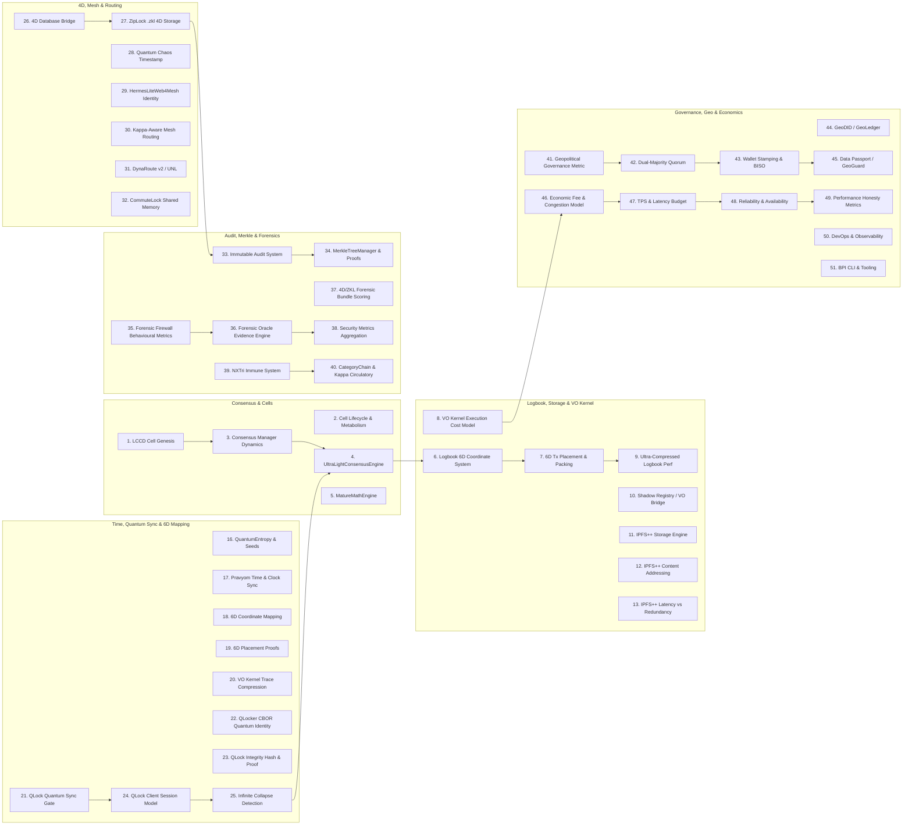
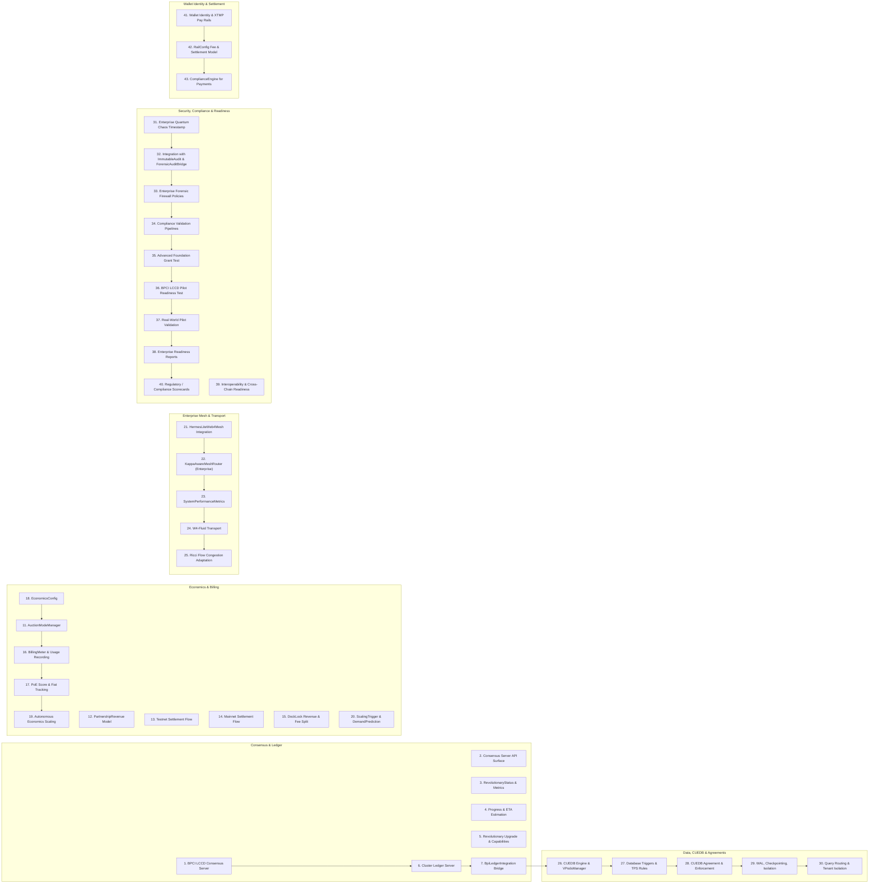
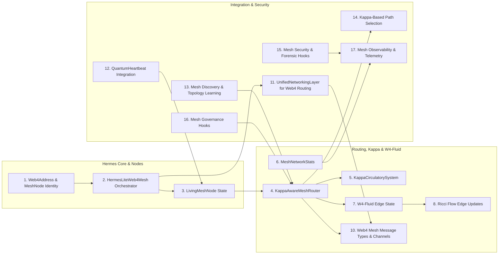

# Pravyom / BPI–BPCI–Hermes Architecture Digraph – Index

This file lists the high-level architectural components for three closely related systems:

- **Set A** – BPI Core Architecture (51 components).  
- **Set B** – BPCI Enterprise Architecture (43 components).  
- **Set C** – Hermes / Web4 Mesh P2P Architecture (17 components).

These indices are intended as anchors for future architecture diagrams and math sections.

---

## Set A – BPI Core Architecture (51 Components)

1. **LCCD Cell Genesis Hardware Profile & Thresholds**  
2. **LCCD Cell Lifecycle & Metabolism (Health, Ops/sec, Divisions)**  
3. **LCCD Consensus Manager Performance & Division Dynamics**  
4. **UltraLightConsensusEngine Voting Power & Finality Thresholds (VO Kernel)**  
5. **MatureMathEngine Byzantine / Safety / Liveness Parameters**  

6. **Logbook 6D Coordinate System & State Anchoring**  
7. **6D Transaction Placement & Block Packing Heuristics**  
8. **VO Kernel Execution Cost Model & Gas Accounting**  
9. **Ultra-Compressed Logbook Performance Envelope (Throughput vs Size)**  
10. **Shadow Registry / VO-Kernel Bridge Latency & Overhead Model**  

11. **Pravyom IPFS++ Storage Engine (Reliability, Replication Factor)**  
12. **IPFS++ Content Addressing & Chunking Geometry**  
13. **IPFS++ Latency vs Redundancy Trade-off Curves**  
14. **HTTPCG Domain Registry Trust & TLS/HTTPS Mapping Logic**  
15. **ShadowRegistry Web2/Web3 Address Mapping Semantics**  

16. **QuantumEntropy & Seed Generation for Crypto / QLock**  
17. **Pravyom Time & Global Clock Synchronization Tolerances**  
18. **6D Blockchain Coordinate Mapping (tx, block, lane, etc.)**  
19. **6D Placement Proof Generation & Verification Cost**  
20. **VO Kernel Execution Trace Compression & Replay Guarantees**  

21. **QLock Quantum Sync Gate (VM Server) – Sync1/Sync0 Dynamics**  
22. **QLocker CBOR Quantum Sync Identity (sin²θ + cos²θ = 1) & Precision Bounds**  
23. **QLock Integrity Hash & Quantum Proof Construction (CBOR Integration)**  

24. **QLock Client Session Model (Timeouts, Heartbeats, Quantum-Safe Flag)**  
25. **QLock Infinite Collapse Detection & Failure Conditions**  

26. **4D Database Bridge Access Patterns & Query Placement**  
27. **ZipLock / .zkl 4D Storage Hashing & Addressing**  
28. **Quantum Chaos Timestamp / QuantumHeartbeatSystem Time Modelling**  
29. **HermesLiteWeb4Mesh Node Identity & Web4Address Geometry**  
30. **Kappa-Aware Mesh Routing & Path Selection**  

31. **DynaRoute v2 / Unified Networking Layer (Virtual Ports & Service Registration)**  
32. **CommuteLock Shared Memory & Event Capacity Planning**  
33. **Immutable Audit System Event Hashing & Proof Linkage**  
34. **MerkleTreeManager & Logbook Proof Construction**  
35. **Forensic Firewall Behavioural Metrics & Baselines**  

36. **Forensic Oracle Evidence Scoring & Correlation Engine**  
37. **4D / ZKL Forensic Bundle and BpiBundle Scoring**  
38. **Security Metrics Aggregation (Threat Scores, Readiness Indices)**  
39. **NXTri Immune System Security Health Model**  
40. **CategoryChain Nervous System & Kappa Circulatory System Mathematics**  

41. **Geopolitical Governance Alignment Metric (Mᵢ(A))**  
42. **Dual-Majority Quorum & Anti-Capture Voting Math**  
43. **Wallet Stamping & BISO Agreement Scoring (Access Levels)**  
44. **GeoDID / GeoLedger Jurisdiction & Adjacency Modelling**  
45. **Data Passport / GeoGuard Cross-Border Risk Scoring**  

46. **Economic Fee & Congestion Model (Base Fee + Tip + Utilization)**  
47. **Throughput / TPS & Latency Budget Across the Pipeline**  
48. **Multi-Component Reliability & Availability (MTBF/MTTR, Series Pipelines)**  
49. **Claimed vs Observed Performance Consistency (Speedup & Honesty Metrics)**  

50. **BPI Core DevOps & Observability Stack (Metrics, Tracing, Alerts)**  
51. **BPI CLI / Tooling Surface (Chain, Mempool, Economics, Governance Commands)**  

---

## Set B – BPCI Enterprise Architecture (43 Components)

1. **BPCI LCCD Consensus Server (RevolutionaryConsensus Engine)**  
2. **BpciConsensusServer gRPC / HTTP API Surface**  
3. **RevolutionaryStatus & RevolutionaryConsensusResult Metrics Model**  
4. **BPCI Consensus Progress & ETA (calculate_progress_percentage, estimate_completion_time)**  
5. **Revolutionary Upgrade & Capability Coverage (BpciLccdRevolutionaryUpgrade)**  

6. **BPCI Cluster Ledger Server & Real Node Validation (bpci_cluster_ledger_server)**  
7. **BpiLedgerIntegration & LedgerMetrics Bridge**  
8. **Enterprise Ledger Performance Telemetry (real node TPS, block time, height)**  
9. **Cluster Health & Auto-Recovery Supervisors**  
10. **Gateway / API Frontend for Enterprise Workloads**  

11. **AuctionModeManager (Testnet vs Mainnet Economics)**  
12. **PartnershipRevenue & Revenue-Sharing Percentages**  
13. **Testnet Settlement Flow (Zero Partnership, Simulation Only)**  
14. **Mainnet Settlement Flow (Community + Roundtable Allocations)**  
15. **DockLock Revenue Integration & Fee Split (owner, treasury, community)**  

16. **BillingMeter & Usage Recording (ResourceConsumption → CostBreakdown)**  
17. **Proof-of-Economic-Activity (PoE) Score & Fiat Value Tracking**  
18. **EconomicsConfig (base_fee, gas_price, reward_rate, inflation_rate)**  
19. **Autonomous Economics Scaling (Demand, Utilization, Revenue, Profit)**  
20. **ScalingTrigger & DemandPrediction Models**  

21. **HermesLiteWeb4Mesh Enterprise Integration (bpci-enterprise)**  
22. **KappaAwareMeshRouter for Enterprise Nodes**  
23. **SystemPerformanceMetrics (transactions_per_second, latency, health_score)**  
24. **W4-Fluid Transport (weight, viscosity ν, temperature Θ, curvature κ, density ρ)**  
25. **Ricci Flow-Based Load & Congestion Adaptation**  

26. **CUEDB Enterprise Engine & VPodsManager (tenant isolation & resources)**  
27. **Database Triggers & TransactionRateThreshold Rules (DatabaseTrigger)**  
28. **CUEDB Agreement & Dynamic Enforcement Levels**  
29. **Write-Ahead Logging, Checkpointing & Isolation Levels**  
30. **Enterprise Query Routing & Tenant Isolation Policies**  

31. **BPCI Quantum Chaos Timestamp / Enterprise Time Anchoring**  
32. **Integration with ImmutableAuditSystem & ForensicAuditBridge**  
33. **Enterprise-Grade Forensic Firewall Policies & Dynamic Response**  
34. **Compliance Validation Pipelines (Grant & Foundation Tests)**  
35. **Advanced Foundation Grant Test (LCCD Throughput & Energy Efficiency)**  

36. **BPCI LCCD Pilot Readiness Test (Total Readiness Score, Limitations)**  
37. **Real-World Pilot Validation (Production Stability & Pilot-Ready Check)**  
38. **Enterprise Readiness Report Generation & Storage**  
39. **Interoperability & Cross-Chain Readiness Demonstrations**  
40. **Regulatory / Compliance Scorecards for Enterprise Deployments**  

41. **Wallet Identity & XTMP Pay Rails (ACH/SEPA/RTP/BPI/SWIFT)**  
42. **RailConfig Fee & Settlement Model (base_fee, percentage_fee, settlement_time)**  
43. **ComplianceEngine (jurisdictions, sanctions, PEP) for Enterprise Payments**  

---

## Set C – Hermes / Web4 Mesh P2P Architecture (17 Components)

1. **Web4Address & MeshNode Identity Model**  
2. **HermesLiteWeb4Mesh Core Orchestrator**  
3. **LivingMeshNode State (health, capabilities, layer, quantum_channel)**  
4. **KappaAwareMeshRouter (routing_table, kappa_weights, mesh_topology)**  
5. **KappaCirculatorySystem (κ history, braid-based κ computation)**  

6. **MeshNetworkStats (latency, packet_loss, uptime, κ-health)**  
7. **W4-Fluid Edge State (weight w, viscosity ν, temperature Θ, curvature κ, density ρ)**  
8. **Ricci Flow Update Rules for Edge Weights & Congestion Healing**  
9. **Mesh Health Status & Node Degradation / Quarantine Logic**  
10. **Web4 Mesh Message Types & Consensus Channels**  

11. **UnifiedNetworkingLayer for Web4 Routing (wallets, services, DynaRoute)**  
12. **QuantumHeartbeat Integration for Mesh Proof-of-Life**  
13. **Hermes Mesh Discovery & Neighbor Topology Learning**  
14. **Kappa-Based Path Selection & Re-Routing under Failures**  
15. **Mesh Security & Forensic Hooks (ForensicAuditBridge, ImmutableAuditSystem)**  

16. **Mesh Governance Hooks (weights from Geo/Gov metrics, access tiers)**  
17. **Hermes Mesh Observability & Telemetry Export (prometheus/logging layer)**  

---

## Top-Level Architecture Digraph (Mermaid Sketch)

The following Mermaid diagram is a **coarse continent map** that groups the detailed component lists above into three clusters and shows only the main flows between them.

This sketch is intentionally high-level; sub-diagrams can later refine each cluster down to the full component lists in Sets A, B, and C.

---

## Cluster Sub-Diagrams (Mermaid Sketches)

The following diagrams refine each cluster down to the **component level**, still keeping edges high-level and grouped by theme.

### BPI Core – Component-Level Digraph (Sketch)

### BPCI Enterprise – Component-Level Digraph (Sketch)

### Hermes / Web4 Mesh – Component-Level Digraph (Sketch)

